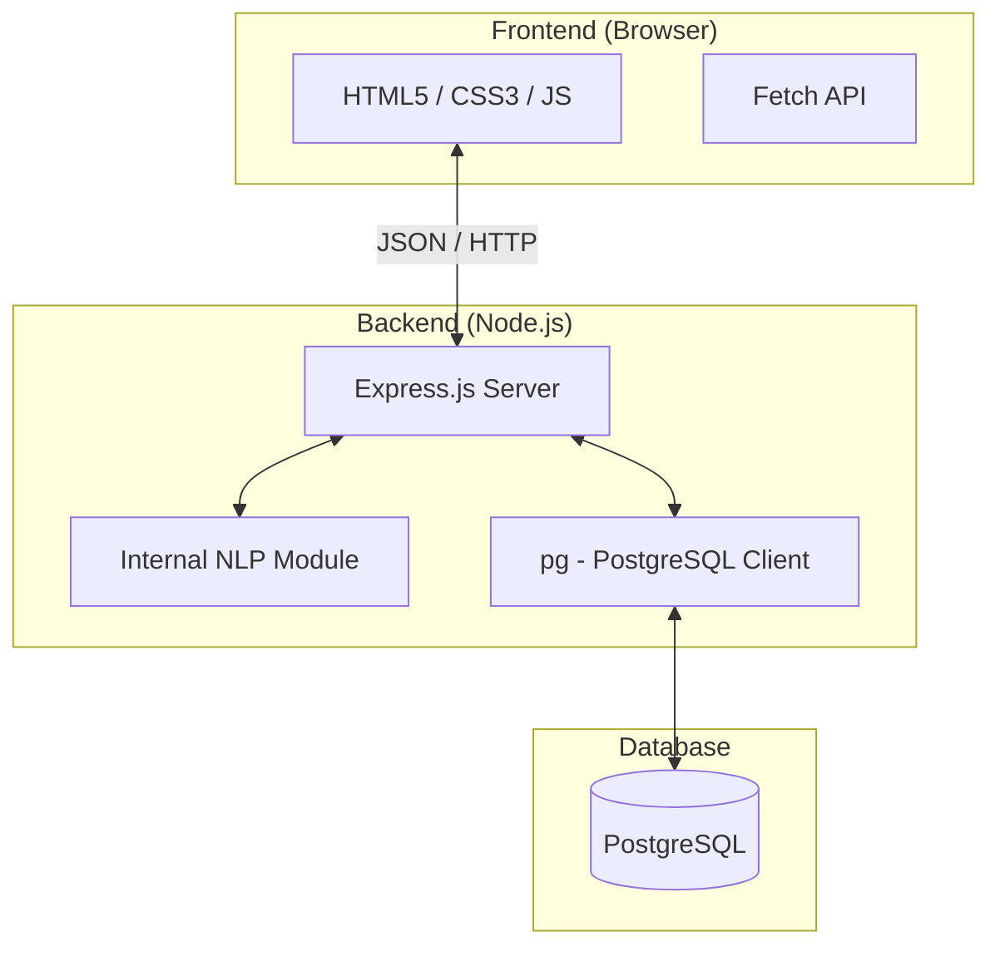

# HackHub - Technical Architecture

This document describes the architectural design, data flow, and system components of the HackHub Hackathon Management System.

---

## 1. High-Level Architecture

HackHub follows a **Decoupled Client-Server Architecture** using a pure JavaScript stack.

### Architectural Decisions:
- **Pure JavaScript Stack:** To ensure beginner-friendliness and minimize environment overhead, the system uses Node.js for both the backend and the "AI" (NLP) logic, eliminating the need for a separate Python environment.
- **RESTful API:** Communication between the frontend and backend is handled via standard REST endpoints using JSON.
- **Internal NLP Integration:** Unlike the original plan, the NLP evaluator is a module within the Node.js process. This ensures synchronous evaluation and immediate feedback for users without managing microservice communication.

---

## 2. Core Modules

### 2.1 Authentication & Security
- **Mechanism:** Session-based or State-based (localStorage) logic.
- **Hashing:** User passwords are encrypted using `bcryptjs` before being stored in the database.
- **Access Control:** Role-based logic (Student, Organizer, Admin) is enforced by the backend API.

### 2.2 NLP Evaluation Engine (`nlp.js`)
This is the "brain" of the system. It works without external APIs (like OpenAI) to ensure it's free and always available.
- **Tokenization:** Converts project descriptions into searchable word lists.
- **TF-IDF Logic:** Identifies how "unique" a word is in a specific hackathon context.
- **Cosine Similarity:** Measures the distance between a new idea and past ideas (Innovation) or the theme (Relevance).
- **Rule-Based Scoring:** Checks for specific technical tools (React, Node, etc.) to determine Feasibility.

### 2.3 Team Management
- **Leadership:** The user who creates a team is automatically assigned as the `leader`.
- **Membership:** Uses a join-request/accept model stored in the `team_members` table.
- **Open Teams:** A flag determines if a team is visible in the "Find Teammates" search results.

---

## 3. Key Data Flows

### 3.1 Idea Submission & Evaluation
1. **Frontend:** User submits a form with title, description, and solution.
2. **Backend:** 
    - Saves the submission to `submissions` table.
    - Triggers `nlp.evaluateIdea()`.
    - `nlp.js` compares the text against all other submissions in that specific hackathon.
3. **Database:** The generated scores and rationale are saved to the `ai_evaluations` table.
4. **Frontend:** Redirects to `results.html` which fetches and animates the scores.

### 3.2 Leaderboard Calculation
- **Global:** Aggregates points from the `users` table directly.
- **Per-Hackathon:** Aggregates `leaderboard_entries` filtered by `hackathon_id`.
- **Points Engine:** Points are awarded for Submitting (+15), being Shortlisted (+25), and Winning (+100).

---

## 4. Deployment Strategy

The system is designed to be deployed on a single VM or Server:
1. **Database:** PostgreSQL instance.
2. **Application:** A Node.js process running `server.js`.
3. **Static Assets:** The HTML/CSS/JS files served via Express `static()` or a web server like Nginx.
