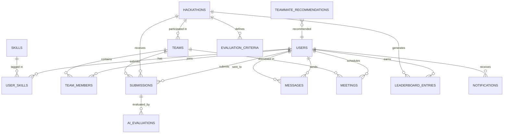

# 🚀 HackHub — Hackathon Management System

> A full-stack platform for organizing, managing, and participating in college hackathons — featuring AI-powered idea evaluation and smart teammate recommendations.

[](https://nodejs.org/)
[](https://expressjs.com/)
[](https://www.postgresql.org/)
[](https://python.org/)

---

## 📋 Table of Contents

- [Overview](#overview)
- [Features](#features)
- [Tech Stack](#tech-stack)
- [Architecture](#architecture)
- [Project Structure](#project-structure)
- [Database Schema](#database-schema)
- [AI / NLP Pipeline](#ai--nlp-pipeline)
- [API Endpoints](#api-endpoints)
- [Getting Started](#getting-started)
- [Environment Variables](#environment-variables)
- [Screenshots](#screenshots)
- [Team](#team)

---

## Overview

**HackHub** is a web-based Hackathon Management System built as a college project. It enables organizers to create hackathons, students to form teams and submit ideas, and an AI engine to automatically evaluate submissions using NLP techniques — all without any external LLM or paid API.

---

## Features

| Module | Description |
|--------|-------------|
| **🔐 Auth & Profiles** | Register, login, profile editing, skill management, GitHub/LinkedIn integration |
| **🏆 Hackathon Management** | Create, browse, and register for hackathons with status lifecycle management |
| **🤖 AI Pre-Assessment** | NLP-based idea evaluation scoring Innovation, Feasibility, Relevance, and Clarity |
| **👥 Teams & Collaboration** | Create/join teams, browse open teams, AI-powered teammate recommendations |
| **💬 Messaging** | Direct messages and team group chat with unread indicators |
| **📅 Meetings** | Schedule team meetings with links, location, and RSVP tracking |
| **📊 Leaderboard** | Global and per-hackathon rankings with a points-based reward system |
| **🛡️ Admin Panel** | User management, hackathon CRUD, submission review queue, system analytics |

---

## Tech Stack

| Layer | Technology |
|-------|------------|
| **Frontend** | HTML5, CSS3, Vanilla JavaScript |
| **Backend** | Node.js, Express.js |
| **Database** | PostgreSQL 15+ |
| **AI / NLP Service** | Python 3.11, Flask, scikit-learn, NLTK, textstat |
| **Auth** | bcryptjs (password hashing) |
| **ORM** | Raw SQL via `pg` (node-postgres) |

---

## Architecture

```
┌─────────────────────────────────────────────────────────┐
│                    Client (Browser)                     │
│              HTML / CSS / Vanilla JS                    │
└───────────────────────┬─────────────────────────────────┘
                        │ HTTP (Fetch API)
                        ▼
┌─────────────────────────────────────────────────────────┐
│               Node.js / Express Server                  │
│                    (port 3000)                           │
│                                                         │
│  ┌──────────┐ ┌───────────┐ ┌────────────┐ ┌────────┐  │
│  │   Auth   │ │ Hackathon │ │   Teams    │ │ Admin  │  │
│  │  Routes  │ │  Routes   │ │   Routes   │ │ Routes │  │
│  └──────────┘ └───────────┘ └────────────┘ └────────┘  │
│  ┌──────────┐ ┌───────────┐ ┌────────────┐ ┌────────┐  │
│  │ Messages │ │ Meetings  │ │ Submission │ │Leaderb.│  │
│  │  Routes  │ │  Routes   │ │   Routes   │ │ Routes │  │
│  └──────────┘ └───────────┘ └────────────┘ └────────┘  │
│                    │             │                       │
│          ┌─────────┘             │                       │
│          ▼                       ▼                       │
│  ┌──────────────┐     ┌───────────────────┐             │
│  │   nlp.js     │     │   db.js (Pool)    │             │
│  │ (Node NLP)   │     │   via dotenv      │             │
│  └──────────────┘     └────────┬──────────┘             │
└────────────────────────────────┼─────────────────────────┘
                                 │ TCP :5432
                                 ▼
                  ┌───────────────────────────┐
                  │     PostgreSQL Database    │
                  │     15 tables · hackhub    │
                  └───────────────────────────┘

┌─────────────────────────────────────────────────────────┐
│           Python Flask AI Microservice (NLP/)           │
│                     (port 5000)                         │
│                                                         │
│  ┌────────────────┐  ┌─────────────────┐                │
│  │  evaluator.py  │  │ recommender.py  │                │
│  │  TF-IDF + NLP  │  │ Skill Matching  │                │
│  └────────────────┘  └─────────────────┘                │
│  ┌────────────────────────┐  ┌──────────────────┐       │
│  │ feedback_generator.py  │  │ corpus_manager.py│       │
│  └────────────────────────┘  └──────────────────┘       │
└─────────────────────────────────────────────────────────┘
```

---

## Project Structure

```
HackHub/
├── HackHub-Frontend/          # Client-side UI
│   ├── index.html             # Landing page
│   ├── login.html             # Login
│   ├── register.html          # Registration
│   ├── dashboard.html         # Student dashboard
│   ├── profile.html           # View profile
│   ├── edit-profile.html      # Edit profile + skills
│   ├── hackathons.html        # Browse hackathons
│   ├── hackathon-detail.html  # Single hackathon view
│   ├── submit-idea.html       # Idea submission form
│   ├── results.html           # AI evaluation results
│   ├── create-team.html       # Create a new team
│   ├── find-teammates.html    # Search/AI-recommended teammates
│   ├── team-dashboard.html    # Team overview
│   ├── inbox.html             # Message inbox
│   ├── conversation.html      # Chat thread
│   ├── schedule-meeting.html  # Schedule a meeting
│   ├── leaderboard.html       # Global rankings
│   ├── admin.html             # Admin panel
│   ├── forgot-password.html   # Password recovery
│   ├── style.css              # Global stylesheet
│   └── script.js              # Shared frontend logic & API calls
│
├── HackHub-Backend/           # Node.js REST API
│   ├── server.js              # Express app — all API routes
│   ├── db.js                  # PostgreSQL connection (dotenv)
│   ├── nlp.js                 # Node-based NLP scoring engine
│   ├── table.sql              # Database schema (15 tables)
│   ├── seed.sql               # Sample seed data
│   ├── generate-hash.js       # BCrypt hash utility
│   ├── test-db.js             # DB connection test script
│   ├── package.json           # Node dependencies
│   ├── .env                   # 🔒 DB credentials (gitignored)
│   └── .gitignore             # Ignores .env, node_modules
│
├── NLP/                       # Python AI Microservice
│   ├── app.py                 # Flask server (port 5000)
│   ├── evaluator.py           # Multi-criteria idea scorer
│   ├── recommender.py         # Teammate recommendation engine
│   ├── feedback_generator.py  # Natural-language feedback builder
│   ├── text_preprocessor.py   # Tokenization, stopword removal
│   ├── corpus_manager.py      # Manages past-submission corpus
│   ├── config.py              # Flask & DB configuration
│   ├── db.py                  # PostgreSQL connector (Python)
│   ├── seed_corpus.json       # Initial corpus for TF-IDF
│   └── requirements.txt       # Python dependencies
│
├── .gitignore                 # Root-level gitignore
└── README.md                  # ← You are here
```

---

## Database Schema

The system uses **15 PostgreSQL tables** defined in `HackHub-Backend/table.sql`:



### Tables Overview

| # | Table | Purpose |
|---|-------|---------|
| 1 | `users` | User accounts with role, profile, and points |
| 2 | `skills` | Skill catalog (language, framework, tool, etc.) |
| 3 | `user_skills` | User ↔ Skill mapping with proficiency level |
| 4 | `hackathons` | Hackathon events with status lifecycle |
| 5 | `evaluation_criteria` | Scoring criteria per hackathon |
| 6 | `teams` | Teams within a hackathon |
| 7 | `team_members` | Team membership (leader/member roles) |
| 8 | `submissions` | Idea/project submissions |
| 9 | `ai_evaluations` | AI-generated scores per submission |
| 10 | `messages` | Direct and team group messages |
| 11 | `meetings` | Scheduled meetings with links/location |
| 12 | `meeting_attendees` | Meeting RSVP tracking |
| 13 | `notifications` | In-app notification system |
| 14 | `leaderboard_entries` | Global/per-hackathon point rankings |
| 15 | `teammate_recommendations` | AI-generated teammate matches |

---

## AI / NLP Pipeline

The AI engine evaluates hackathon idea submissions using **classical NLP** — no external LLM or API key required.

### Scoring Criteria

| Criterion | Method | Weight |
|-----------|--------|--------|
| **Innovation** | TF-IDF cosine similarity against past submissions. Lower similarity → higher novelty score. Generic keywords penalized. | 30% |
| **Feasibility** | Rule-based checks: tech stack mentioned, solution length, problem clarity, structural completeness. | 25% |
| **Relevance** | TF-IDF cosine similarity between the submission and the hackathon's theme description. | 25% |
| **Clarity** | Readability scoring (Flesch-Kincaid), structural checks, grammar heuristics. | 20% |

### Pipeline Flow

```
Submission → Text Preprocessing → TF-IDF Vectorization → Multi-Criteria Scoring → Feedback Generation → DB Storage
```

### Teammate Recommendation

1. Extract the requesting user's skill vector (one-hot encoded with proficiency weights)
2. For each candidate not on a full team:
   - **Skill complement score** — covers skills the team lacks
   - **Diversity bonus** — rewards different departments/backgrounds
   - **Performance score** — normalized leaderboard points
3. Return top recommendations with natural-language match reasons

---

## API Endpoints

### Authentication
| Method | Endpoint | Description |
|--------|----------|-------------|
| POST | `/api/register` | Register a new user |
| POST | `/api/login` | Login with email & password |

### Users
| Method | Endpoint | Description |
|--------|----------|-------------|
| GET | `/api/users` | List all users (admin) |
| GET | `/api/users/:id` | Get user profile + skills |
| PUT | `/api/users/:id` | Update user profile |
| PUT | `/api/users/:id/toggle` | Toggle user active status (admin) |
| POST | `/api/users/:id/skills` | Add/update skill for a user |

### Hackathons
| Method | Endpoint | Description |
|--------|----------|-------------|
| GET | `/api/hackathons` | List all hackathons |
| GET | `/api/hackathons/:id` | Get hackathon detail + criteria |
| POST | `/api/hackathons` | Create a hackathon |
| PUT | `/api/hackathons/:id` | Update hackathon status |

### Teams
| Method | Endpoint | Description |
|--------|----------|-------------|
| GET | `/api/teams` | List teams (optionally by hackathon) |
| GET | `/api/teams/:id` | Get team detail with members |
| POST | `/api/teams` | Create a new team |
| POST | `/api/teams/:id/join` | Join a team |

### Submissions
| Method | Endpoint | Description |
|--------|----------|-------------|
| GET | `/api/submissions` | List submissions (optionally by hackathon) |
| GET | `/api/submissions/:id` | Get submission + AI evaluation |
| POST | `/api/submissions` | Submit idea (triggers AI evaluation) |

### Leaderboard
| Method | Endpoint | Description |
|--------|----------|-------------|
| GET | `/api/leaderboard` | Global or per-hackathon rankings |

### Messages
| Method | Endpoint | Description |
|--------|----------|-------------|
| GET | `/api/messages/:userId` | Get inbox for a user |
| POST | `/api/messages` | Send a message |
| PUT | `/api/messages/:id/read` | Mark message as read |

### Meetings
| Method | Endpoint | Description |
|--------|----------|-------------|
| GET | `/api/meetings` | Get meetings for a user |
| POST | `/api/meetings` | Schedule a new meeting |

### Notifications
| Method | Endpoint | Description |
|--------|----------|-------------|
| GET | `/api/notifications/:userId` | Get notifications |
| PUT | `/api/notifications/:id/read` | Mark notification as read |

### Dashboard & Admin
| Method | Endpoint | Description |
|--------|----------|-------------|
| GET | `/api/dashboard/:userId` | Aggregated dashboard data |
| GET | `/api/admin/stats` | System-wide statistics |

---

## Getting Started

### Prerequisites

- **Node.js** 18+
- **PostgreSQL** 15+
- **Python** 3.11+ (for the NLP microservice)

### 1. Clone the Repository

```bash
git clone https://github.com/your-username/HackHub.git
cd HackHub
```

### 2. Set Up the Database

```bash
# Create the database
psql -U postgres -c "CREATE DATABASE hackhub;"

# Run the schema
psql -U postgres -d hackhub -f HackHub-Backend/table.sql

# (Optional) Seed sample data
psql -U postgres -d hackhub -f HackHub-Backend/seed.sql
```

### 3. Configure Environment Variables

Create `HackHub-Backend/.env`:

```env
DB_HOST=localhost
DB_PORT=5432
DB_NAME=hackhub
DB_USER=postgres
DB_PASSWORD=your_password_here
```

> ⚠️ The `.env` file is gitignored. Never commit credentials.

### 4. Install & Run the Backend

```bash
cd HackHub-Backend
npm install
npm start
```

The API server starts at `http://localhost:3000`.

### 5. Install & Run the NLP Service (Optional)

```bash
cd NLP
pip install -r requirements.txt
python app.py
```

The Flask service starts at `http://localhost:5000`.

### 6. Open the Frontend

Open `HackHub-Frontend/index.html` directly in your browser, or serve it with any static file server:

```bash
# Quick option using Python
cd HackHub-Frontend
python -m http.server 8080
```

Then visit `http://localhost:8080`.

---

## Environment Variables

| Variable | Description | Default |
|----------|-------------|---------|
| `DB_HOST` | PostgreSQL host | `localhost` |
| `DB_PORT` | PostgreSQL port | `5432` |
| `DB_NAME` | Database name | `hackhub` |
| `DB_USER` | Database user | `postgres` |
| `DB_PASSWORD` | Database password | — |

---

## Security

| Area | Implementation |
|------|----------------|
| **Passwords** | BCrypt hashing via `bcryptjs` |
| **SQL Injection** | Parameterized queries (`$1, $2, ...`) throughout |
| **Credentials** | Stored in `.env`, excluded from version control via `.gitignore` |
| **CORS** | Enabled via `cors` middleware |
| **AI Service** | Runs on localhost only — not exposed externally |

---

## Team

| Role | Responsibilities |
|------|-----------------|
| **Backend Lead** | Database schema, Express API, authentication, admin routes |
| **Frontend Lead** | All HTML pages, CSS, client-side JavaScript, responsive design |
| **AI/ML Developer** | Python NLP pipeline, idea evaluator, teammate recommender |
| **Full Stack / QA** | Integration, testing, deployment, documentation |

---

<p align="center">
  Built with ❤️ for college hackathons
</p>
