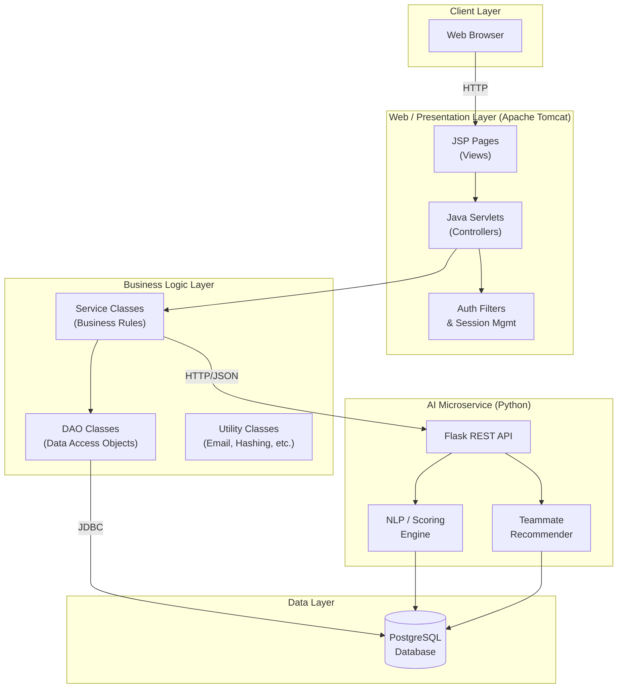
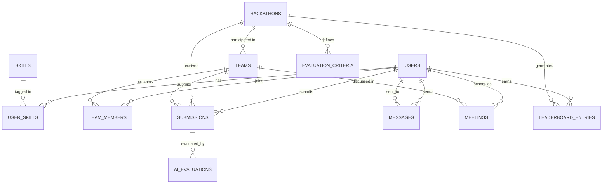
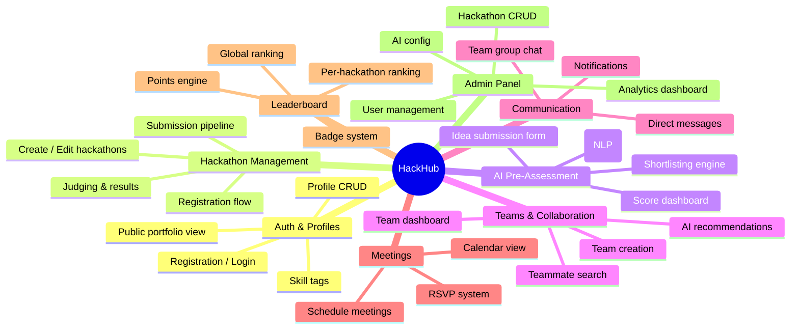
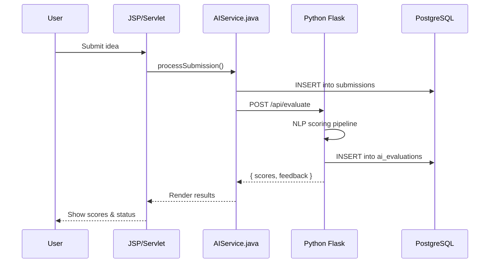
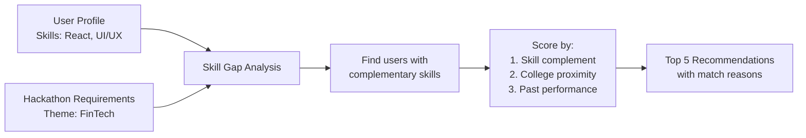
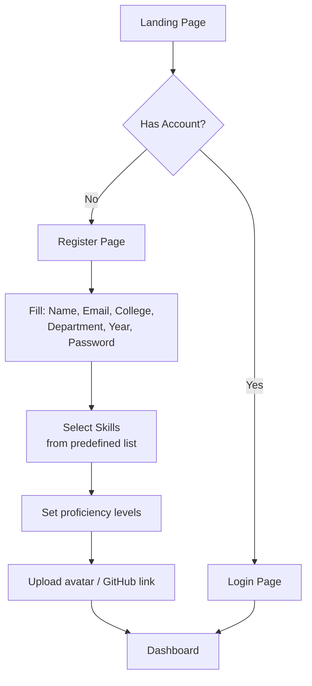
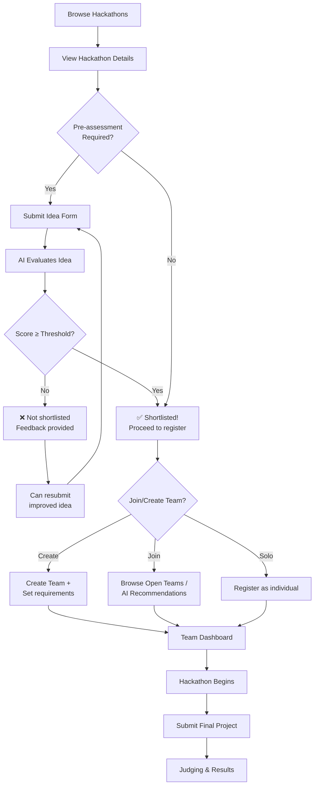

# Hackathon Management System — Complete Project Plan

> **Codename:** HackHub  
> **Stack:** JSP · JDBC · PostgreSQL · Python (AI microservice)  
> **Target Team:** 4–6 college students  
> **Timeline:** ~12 weeks

---

## 1. System Architecture

### 1.1 High-Level Overview



### 1.2 Architecture Pattern — MVC (Model-View-Controller)

| Layer | Technology | Responsibility |
|-------|-----------|----------------|
| **View** | JSP + JSTL + CSS/JS | Render HTML, forms, dashboards |
| **Controller** | Java Servlets | Route requests, validate input, call services |
| **Model** | Java POJOs + DAO | Business entities, database access via JDBC |
| **AI Service** | Python Flask | Idea evaluation, teammate recommendations |

### 1.3 Directory Structure

```
HackHub/
├── src/
│   └── main/
│       ├── java/
│       │   └── com/hackhub/
│       │       ├── controller/        # Servlets
│       │       │   ├── AuthServlet.java
│       │       │   ├── ProfileServlet.java
│       │       │   ├── HackathonServlet.java
│       │       │   ├── TeamServlet.java
│       │       │   ├── MessageServlet.java
│       │       │   ├── MeetingServlet.java
│       │       │   ├── LeaderboardServlet.java
│       │       │   └── AdminServlet.java
│       │       ├── model/             # POJOs
│       │       │   ├── User.java
│       │       │   ├── Hackathon.java
│       │       │   ├── Team.java
│       │       │   ├── Submission.java
│       │       │   ├── Message.java
│       │       │   ├── Meeting.java
│       │       │   └── Skill.java
│       │       ├── dao/               # Data Access Objects
│       │       │   ├── UserDAO.java
│       │       │   ├── HackathonDAO.java
│       │       │   ├── TeamDAO.java
│       │       │   ├── SubmissionDAO.java
│       │       │   ├── MessageDAO.java
│       │       │   ├── MeetingDAO.java
│       │       │   └── LeaderboardDAO.java
│       │       ├── service/           # Business Logic
│       │       │   ├── AuthService.java
│       │       │   ├── ProfileService.java
│       │       │   ├── TeamService.java
│       │       │   └── AIService.java  # HTTP client to Python
│       │       ├── filter/            # Servlet Filters
│       │       │   └── AuthFilter.java
│       │       └── util/              # Utilities
│       │           ├── DBConnection.java
│       │           ├── PasswordUtil.java
│       │           └── EmailUtil.java
│       └── webapp/
│           ├── WEB-INF/
│           │   └── web.xml
│           ├── css/
│           ├── js/
│           ├── images/
│           └── jsp/
│               ├── auth/
│               │   ├── login.jsp
│               │   ├── register.jsp
│               │   └── forgot-password.jsp
│               ├── profile/
│               │   ├── view-profile.jsp
│               │   ├── edit-profile.jsp
│               │   └── public-profile.jsp
│               ├── hackathon/
│               │   ├── list.jsp
│               │   ├── detail.jsp
│               │   ├── submit-idea.jsp
│               │   └── results.jsp
│               ├── team/
│               │   ├── create-team.jsp
│               │   ├── find-teammates.jsp
│               │   └── team-dashboard.jsp
│               ├── messages/
│               │   ├── inbox.jsp
│               │   └── conversation.jsp
│               ├── meetings/
│               │   ├── schedule.jsp
│               │   └── calendar.jsp
│               ├── leaderboard/
│               │   └── leaderboard.jsp
│               ├── admin/
│               │   ├── dashboard.jsp
│               │   ├── manage-hackathons.jsp
│               │   └── review-submissions.jsp
│               └── common/
│                   ├── header.jsp
│                   ├── footer.jsp
│                   └── sidebar.jsp
├── ai-service/                        # Python AI Microservice
│   ├── app.py
│   ├── evaluator.py
│   ├── recommender.py
│   ├── requirements.txt
│   └── models/
├── sql/
│   ├── 01_schema.sql
│   ├── 02_seed.sql
│   └── 03_indexes.sql
└── docs/
    └── api-contract.md
```

---

## 2. Database Schema (PostgreSQL)

### 2.1 Entity-Relationship Diagram



### 2.2 Full SQL Schema

```sql
-- ============================================================
-- 01_schema.sql — HackHub Database Schema
-- ============================================================

-- 1. Users
CREATE TABLE users (
    user_id         SERIAL PRIMARY KEY,
    email           VARCHAR(255) UNIQUE NOT NULL,
    password_hash   VARCHAR(255) NOT NULL,
    full_name       VARCHAR(150) NOT NULL,
    username        VARCHAR(50) UNIQUE NOT NULL,
    role            VARCHAR(20) NOT NULL DEFAULT 'student'
                    CHECK (role IN ('student', 'organizer', 'admin', 'mentor')),
    college         VARCHAR(200),
    department      VARCHAR(100),
    year_of_study   INT,
    bio             TEXT,
    avatar_url      VARCHAR(500),
    github_url      VARCHAR(300),
    linkedin_url    VARCHAR(300),
    portfolio_url   VARCHAR(300),
    points          INT DEFAULT 0,
    is_active       BOOLEAN DEFAULT TRUE,
    created_at      TIMESTAMP DEFAULT CURRENT_TIMESTAMP,
    updated_at      TIMESTAMP DEFAULT CURRENT_TIMESTAMP
);

-- 2. Skills
CREATE TABLE skills (
    skill_id    SERIAL PRIMARY KEY,
    skill_name  VARCHAR(100) UNIQUE NOT NULL,
    category    VARCHAR(50)
                CHECK (category IN ('language', 'framework', 'tool', 'domain', 'soft_skill'))
);

-- 3. User ↔ Skill mapping
CREATE TABLE user_skills (
    user_skill_id   SERIAL PRIMARY KEY,
    user_id         INT NOT NULL REFERENCES users(user_id) ON DELETE CASCADE,
    skill_id        INT NOT NULL REFERENCES skills(skill_id) ON DELETE CASCADE,
    proficiency     VARCHAR(20) DEFAULT 'intermediate'
                    CHECK (proficiency IN ('beginner', 'intermediate', 'advanced', 'expert')),
    UNIQUE(user_id, skill_id)
);

-- 4. Hackathons
CREATE TABLE hackathons (
    hackathon_id        SERIAL PRIMARY KEY,
    title               VARCHAR(200) NOT NULL,
    description         TEXT,
    theme               VARCHAR(100),
    organizer_id        INT REFERENCES users(user_id),
    max_participants    INT,
    max_team_size       INT DEFAULT 4,
    min_team_size       INT DEFAULT 1,
    registration_start  TIMESTAMP NOT NULL,
    registration_end    TIMESTAMP NOT NULL,
    event_start         TIMESTAMP NOT NULL,
    event_end           TIMESTAMP NOT NULL,
    status              VARCHAR(20) DEFAULT 'draft'
                        CHECK (status IN ('draft', 'open', 'closed', 'in_progress',
                                          'judging', 'completed')),
    requires_preassessment BOOLEAN DEFAULT FALSE,
    venue               VARCHAR(300),
    is_online           BOOLEAN DEFAULT FALSE,
    banner_url          VARCHAR(500),
    created_at          TIMESTAMP DEFAULT CURRENT_TIMESTAMP
);

-- 5. Evaluation Criteria (per hackathon — used by AI & judges)
CREATE TABLE evaluation_criteria (
    criteria_id     SERIAL PRIMARY KEY,
    hackathon_id    INT NOT NULL REFERENCES hackathons(hackathon_id) ON DELETE CASCADE,
    criteria_name   VARCHAR(100) NOT NULL,   -- e.g. "Innovation", "Feasibility"
    weight          DECIMAL(3,2) DEFAULT 1.0, -- relative weight
    description     TEXT
);

-- 6. Teams
CREATE TABLE teams (
    team_id         SERIAL PRIMARY KEY,
    team_name       VARCHAR(100) NOT NULL,
    hackathon_id    INT NOT NULL REFERENCES hackathons(hackathon_id) ON DELETE CASCADE,
    leader_id       INT NOT NULL REFERENCES users(user_id),
    description     TEXT,
    looking_for     TEXT,           -- "Looking for a backend dev with Python experience"
    is_open         BOOLEAN DEFAULT TRUE,
    created_at      TIMESTAMP DEFAULT CURRENT_TIMESTAMP,
    UNIQUE(team_name, hackathon_id)
);

-- 7. Team Members
CREATE TABLE team_members (
    member_id   SERIAL PRIMARY KEY,
    team_id     INT NOT NULL REFERENCES teams(team_id) ON DELETE CASCADE,
    user_id     INT NOT NULL REFERENCES users(user_id) ON DELETE CASCADE,
    role        VARCHAR(50) DEFAULT 'member',  -- "leader", "member", "mentor"
    joined_at   TIMESTAMP DEFAULT CURRENT_TIMESTAMP,
    UNIQUE(team_id, user_id)
);

-- 8. Submissions (Idea / Project submissions)
CREATE TABLE submissions (
    submission_id       SERIAL PRIMARY KEY,
    hackathon_id        INT NOT NULL REFERENCES hackathons(hackathon_id) ON DELETE CASCADE,
    user_id             INT REFERENCES users(user_id),      -- individual
    team_id             INT REFERENCES teams(team_id),      -- or team
    title               VARCHAR(200) NOT NULL,
    idea_description    TEXT NOT NULL,
    problem_statement   TEXT,
    proposed_solution   TEXT,
    tech_stack          TEXT,
    repo_url            VARCHAR(500),
    demo_url            VARCHAR(500),
    presentation_url    VARCHAR(500),
    submission_type     VARCHAR(20) DEFAULT 'idea'
                        CHECK (submission_type IN ('idea', 'project', 'final')),
    status              VARCHAR(20) DEFAULT 'pending'
                        CHECK (status IN ('pending', 'under_review', 'shortlisted',
                                          'rejected', 'accepted', 'winner')),
    submitted_at        TIMESTAMP DEFAULT CURRENT_TIMESTAMP,
    CHECK (user_id IS NOT NULL OR team_id IS NOT NULL)
);

-- 9. AI Evaluations (scores generated by the AI service)
CREATE TABLE ai_evaluations (
    evaluation_id       SERIAL PRIMARY KEY,
    submission_id       INT NOT NULL REFERENCES submissions(submission_id) ON DELETE CASCADE,
    innovation_score    DECIMAL(4,2),   -- 0.00 – 10.00
    feasibility_score   DECIMAL(4,2),
    relevance_score     DECIMAL(4,2),
    clarity_score       DECIMAL(4,2),
    overall_score       DECIMAL(4,2),
    ai_feedback         TEXT,           -- generated rationale
    model_version       VARCHAR(50),
    evaluated_at        TIMESTAMP DEFAULT CURRENT_TIMESTAMP
);

-- 10. Messages
CREATE TABLE messages (
    message_id  SERIAL PRIMARY KEY,
    sender_id   INT NOT NULL REFERENCES users(user_id) ON DELETE CASCADE,
    receiver_id INT NOT NULL REFERENCES users(user_id) ON DELETE CASCADE,
    team_id     INT REFERENCES teams(team_id),  -- NULL = DM, non-null = team chat
    content     TEXT NOT NULL,
    is_read     BOOLEAN DEFAULT FALSE,
    sent_at     TIMESTAMP DEFAULT CURRENT_TIMESTAMP
);

-- 11. Meetings
CREATE TABLE meetings (
    meeting_id      SERIAL PRIMARY KEY,
    title           VARCHAR(200) NOT NULL,
    description     TEXT,
    organizer_id    INT NOT NULL REFERENCES users(user_id),
    team_id         INT REFERENCES teams(team_id),
    hackathon_id    INT REFERENCES hackathons(hackathon_id),
    meeting_time    TIMESTAMP NOT NULL,
    duration_mins   INT DEFAULT 30,
    meeting_link    VARCHAR(500),      -- Google Meet / Zoom link
    location        VARCHAR(300),
    status          VARCHAR(20) DEFAULT 'scheduled'
                    CHECK (status IN ('scheduled', 'in_progress', 'completed', 'cancelled')),
    created_at      TIMESTAMP DEFAULT CURRENT_TIMESTAMP
);

-- 12. Meeting Attendees
CREATE TABLE meeting_attendees (
    attendee_id SERIAL PRIMARY KEY,
    meeting_id  INT NOT NULL REFERENCES meetings(meeting_id) ON DELETE CASCADE,
    user_id     INT NOT NULL REFERENCES users(user_id) ON DELETE CASCADE,
    rsvp_status VARCHAR(20) DEFAULT 'pending'
                CHECK (rsvp_status IN ('pending', 'accepted', 'declined')),
    UNIQUE(meeting_id, user_id)
);

-- 13. Leaderboard Entries
CREATE TABLE leaderboard_entries (
    entry_id        SERIAL PRIMARY KEY,
    user_id         INT NOT NULL REFERENCES users(user_id) ON DELETE CASCADE,
    hackathon_id    INT REFERENCES hackathons(hackathon_id),  -- NULL = global
    points          INT DEFAULT 0,
    rank            INT,
    badges          TEXT,   -- JSON array: ["first_place","innovator"]
    updated_at      TIMESTAMP DEFAULT CURRENT_TIMESTAMP,
    UNIQUE(user_id, hackathon_id)
);

-- 14. Notifications
CREATE TABLE notifications (
    notification_id SERIAL PRIMARY KEY,
    user_id         INT NOT NULL REFERENCES users(user_id) ON DELETE CASCADE,
    type            VARCHAR(50) NOT NULL,  -- 'team_invite', 'submission_result', etc.
    title           VARCHAR(200),
    message         TEXT,
    link            VARCHAR(500),
    is_read         BOOLEAN DEFAULT FALSE,
    created_at      TIMESTAMP DEFAULT CURRENT_TIMESTAMP
);

-- 15. Teammate Recommendations (cached from AI)
CREATE TABLE teammate_recommendations (
    rec_id          SERIAL PRIMARY KEY,
    user_id         INT NOT NULL REFERENCES users(user_id) ON DELETE CASCADE,
    recommended_id  INT NOT NULL REFERENCES users(user_id) ON DELETE CASCADE,
    hackathon_id    INT REFERENCES hackathons(hackathon_id),
    match_score     DECIMAL(4,2),       -- 0.00 – 1.00
    reason          TEXT,               -- "Complementary skills: you need Python, they have it"
    generated_at    TIMESTAMP DEFAULT CURRENT_TIMESTAMP
);

-- ============================================================
-- INDEXES
-- ============================================================
CREATE INDEX idx_users_role ON users(role);
CREATE INDEX idx_users_college ON users(college);
CREATE INDEX idx_user_skills_user ON user_skills(user_id);
CREATE INDEX idx_user_skills_skill ON user_skills(skill_id);
CREATE INDEX idx_submissions_hackathon ON submissions(hackathon_id);
CREATE INDEX idx_submissions_status ON submissions(status);
CREATE INDEX idx_messages_receiver ON messages(receiver_id, is_read);
CREATE INDEX idx_messages_team ON messages(team_id);
CREATE INDEX idx_meetings_team ON meetings(team_id);
CREATE INDEX idx_leaderboard_hackathon ON leaderboard_entries(hackathon_id, points DESC);
CREATE INDEX idx_notifications_user ON notifications(user_id, is_read);
CREATE INDEX idx_ai_eval_submission ON ai_evaluations(submission_id);
```

---

## 3. Key Modules & Features Breakdown

### Module Map



### 3.1 Module Details

| # | Module | Key Features | Priority |
|---|--------|-------------|----------|
| 1 | **Auth & Profiles** | Register, login, logout, password hashing (BCrypt), session management via `HttpSession`, role-based access (student/organizer/admin/mentor), edit profile, add/remove skills, public profile page with skill badges | 🔴 Critical |
| 2 | **Hackathon Management** | CRUD for hackathons (organizer/admin), registration with capacity limits, status lifecycle (draft→open→closed→in_progress→judging→completed), define evaluation criteria and weights | 🔴 Critical |
| 3 | **AI Pre-Assessment** | Idea submission form (title, description, problem, solution, tech stack), auto-evaluation via Python service, score breakdown (innovation, feasibility, relevance, clarity), shortlisting by threshold, organizer review/override | 🔴 Critical |
| 4 | **Teams & Collaboration** | Create team for a hackathon, search open teams, request to join, AI-powered teammate recommendation based on complementary skills, team dashboard with member list and shared submissions | 🟡 High |
| 5 | **Messaging** | Direct messages between users, team group chat, unread count badge, conversation threading | 🟡 High |
| 6 | **Meetings** | Schedule meeting with date/time/link, attach to team or hackathon, RSVP (accept/decline), simple calendar view | 🟢 Medium |
| 7 | **Leaderboard** | Global + per-hackathon rankings, points awarded for: participation (+10), shortlisting (+25), winning (+100), badges (JSON stored) | 🟢 Medium |
| 8 | **Admin Panel** | User management (activate/deactivate), hackathon management, submission review queue, view AI evaluation analytics, system stats | 🟡 High |

---

## 4. AI Integration Approach

### 4.1 Architecture

The AI component runs as a **lightweight Python Flask microservice** alongside the Tomcat server. The Java backend communicates with it via simple HTTP REST calls.



### 4.2 Idea Evaluation Pipeline

The AI evaluation does **not** require an external LLM API. It uses classical NLP and rule-based scoring, making it fully self-contained and free to run.

#### Step 1: Text Preprocessing
```
Raw Text → Lowercase → Remove stopwords → Lemmatize → TF-IDF Vector
```

#### Step 2: Multi-Criteria Scoring

| Criterion | How It's Scored | Weight |
|-----------|----------------|--------|
| **Innovation** | Cosine similarity against a corpus of past submissions. Lower similarity = more novel. Penalize generic keywords ("todo app", "chat app"). | 0.30 |
| **Feasibility** | Rule-based: Check if tech stack is mentioned, if timeline acknowledgment exists, if scope is reasonable (word count heuristics). Presence of a structured proposed_solution section boosts score. | 0.25 |
| **Relevance** | Cosine similarity of the submission against the hackathon's **theme description** + **evaluation criteria descriptions**. Higher similarity = more relevant. | 0.25 |
| **Clarity** | Readability score (Flesch-Kincaid or similar), structural completeness (has problem statement + solution + tech stack), grammar quality (simple heuristic). | 0.20 |

#### Step 3: Score Aggregation
```python
overall = (innovation * 0.30) + (feasibility * 0.25) + (relevance * 0.25) + (clarity * 0.20)
```

#### Step 4: Feedback Generation
Template-based feedback combining score brackets:
```
"Your idea scored 7.2/10. Strong innovation (8.5) — the concept is
unique in this hackathon's pool. Consider improving feasibility (5.8)
by specifying a clearer technical approach and realistic timeline."
```

#### Step 5: Shortlisting
- Organizer sets a **cutoff score** (e.g., 6.0/10) and a **max slots** count.
- All submissions above the cutoff are ranked by overall score.
- Top N are auto-shortlisted; rest are marked "under_review" for manual organizer review.

### 4.3 Teammate Recommendation Engine



**Algorithm:**
1. Extract the user's skill vector (one-hot encoded skills with proficiency weights).
2. For each candidate in the same hackathon who is **not** on a full team:
   - Compute **skill complement score**: How many skills does the candidate have that the user's team lacks?
   - Compute **diversity bonus**: Reward different departments/backgrounds.
   - Compute **performance score**: Normalize their leaderboard points.
3. Weighted combination → rank → return top 5 with natural-language reasons.

### 4.4 Python AI Service — API Contract

| Endpoint | Method | Input | Output |
|----------|--------|-------|--------|
| `/api/evaluate` | POST | `{ submission_id, title, description, problem, solution, tech_stack, theme }` | `{ innovation, feasibility, relevance, clarity, overall, feedback }` |
| `/api/recommend` | POST | `{ user_id, hackathon_id, team_skills[] }` | `[ { user_id, match_score, reason } ]` |
| `/api/health` | GET | — | `{ status: "ok" }` |

### 4.5 Python Dependencies (`requirements.txt`)

```
flask==3.0.0
psycopg2-binary==2.9.9
scikit-learn==1.3.2
nltk==3.8.1
textstat==0.7.3
numpy==1.26.2
```

---

## 5. Step-by-Step Development Plan (12 Weeks)

### Phase 0 — Setup & Foundation (Week 1)

| Task | Owner | Deliverable |
|------|-------|-------------|
| Set up PostgreSQL database, run schema SQL | Backend | Live DB with seed data |
| Set up Tomcat project with Maven/Gradle | Backend | Deployable WAR skeleton |
| Create `DBConnection.java` utility (connection pooling) | Backend | Tested DB connectivity |
| Create `PasswordUtil.java` (BCrypt hashing) | Backend | Unit tested |
| Set up Python venv, Flask skeleton, `/api/health` | AI Dev | Running Flask service |
| Create global CSS stylesheet, header/footer JSPs | Frontend | Base UI template |

---

### Phase 1 — Auth & Profiles (Weeks 2–3)

| Task | Owner |
|------|-------|
| `UserDAO` — CRUD operations | Backend |
| `AuthServlet` — login, register, logout | Backend |
| `AuthFilter` — protect routes by role | Backend |
| `login.jsp`, `register.jsp` — forms with validation | Frontend |
| `view-profile.jsp`, `edit-profile.jsp` — skill management | Frontend |
| `public-profile.jsp` — portfolio view with skill badges | Frontend |
| `SkillDAO` — seed skills, user-skill CRUD | Backend |

---

### Phase 2 — Hackathon CRUD (Weeks 3–4)

| Task | Owner |
|------|-------|
| `HackathonDAO` — full CRUD + status management | Backend |
| `HackathonServlet` — list, detail, create, edit, register | Backend |
| `list.jsp` — searchable hackathon cards | Frontend |
| `detail.jsp` — hackathon info + register button | Frontend |
| `manage-hackathons.jsp` — admin/organizer CRUD form | Frontend |
| Define evaluation criteria per hackathon | Backend |

---

### Phase 3 — AI Pre-Assessment (Weeks 5–7)

| Task | Owner |
|------|-------|
| `SubmissionDAO` — submit, list, update status | Backend |
| `submit-idea.jsp` — multi-field idea form | Frontend |
| **Python `evaluator.py`** — full scoring pipeline | AI Dev |
| Integrate `/api/evaluate` with `AIService.java` | Backend |
| `results.jsp` — show score breakdown + feedback | Frontend |
| Shortlisting logic (threshold + rank) | Backend |
| `review-submissions.jsp` — organizer override UI | Frontend |
| Corpus building: collect past ideas for similarity baseline | AI Dev |

> [!IMPORTANT]
> **This is the most complex phase.** The AI scoring pipeline should be developed and tested independently before integration. Use a Jupyter notebook for rapid iteration, then port to Flask.

---

### Phase 4 — Teams & Collaboration (Weeks 7–8)

| Task | Owner |
|------|-------|
| `TeamDAO` — create, join, leave, list | Backend |
| `create-team.jsp`, `find-teammates.jsp` | Frontend |
| Join request + approval flow | Backend |
| `team-dashboard.jsp` — members, submissions, meetings | Frontend |
| **Python `recommender.py`** — teammate matching | AI Dev |
| Integrate `/api/recommend` with `AIService.java` | Backend |
| Display recommendations in `find-teammates.jsp` | Frontend |

---

### Phase 5 — Messaging (Weeks 8–9)

| Task | Owner |
|------|-------|
| `MessageDAO` — send, list conversations, mark read | Backend |
| `MessageServlet` — DM and team chat routing | Backend |
| `inbox.jsp` — conversation list with unread badges | Frontend |
| `conversation.jsp` — message thread (AJAX polling for refresh) | Frontend |
| `NotificationDAO` — generic notification system | Backend |

---

### Phase 6 — Meetings & Leaderboard (Weeks 9–10)

| Task | Owner |
|------|-------|
| `MeetingDAO` — schedule, RSVP, list | Backend |
| `schedule.jsp`, `calendar.jsp` — meeting UI | Frontend |
| `LeaderboardDAO` — points aggregation queries | Backend |
| `leaderboard.jsp` — global + per-hackathon rankings | Frontend |
| Points engine: trigger points on events (submit, shortlist, win) | Backend |

---

### Phase 7 — Admin Panel & Polish (Weeks 10–11)

| Task | Owner |
|------|-------|
| `admin/dashboard.jsp` — stats cards (total users, active hackathons, etc.) | Frontend |
| User management (activate/deactivate) | Backend |
| AI analytics (average scores, rejection rate) | Backend + Frontend |
| Responsive CSS polish | Frontend |
| Error pages (404, 500) | Frontend |
| Input validation & XSS prevention | Backend |

---

### Phase 8 — Testing & Deployment (Week 12)

| Task | Owner |
|------|-------|
| Integration testing (all flows end-to-end) | All |
| Load testing with sample data (50+ users, 5 hackathons, 200 submissions) | Backend |
| Fix bugs from testing | All |
| Write deployment guide | Backend |
| Final demo preparation | All |

---

## 6. Tools & Technologies

| Category | Technology | Purpose |
|----------|-----------|---------|
| **Frontend** | JSP + JSTL | Server-rendered pages |
| **Frontend** | HTML5, CSS3, Vanilla JS | Markup, styling, interactions |
| **Frontend** | Bootstrap 5 (CDN) | Responsive grid, components |
| **Backend** | Java Servlets (Jakarta EE) | Request handling, controller logic |
| **Backend** | JDBC | Database connectivity |
| **Build** | Apache Maven | Dependency management, WAR packaging |
| **Server** | Apache Tomcat 10 | Servlet container |
| **Database** | PostgreSQL 15+ | Primary data store |
| **AI** | Python 3.11 + Flask | AI microservice runtime |
| **AI** | scikit-learn, NLTK | NLP scoring, text similarity |
| **AI** | textstat | Readability scoring |
| **Security** | jBCrypt | Password hashing |
| **Email** | Jakarta Mail (optional) | Notification emails |
| **IDE** | IntelliJ IDEA / VS Code | Development |
| **Version Control** | Git + GitHub | Collaboration |

> [!NOTE]
> **Bootstrap 5** is included via CDN only — no build tooling required. It provides a polished UI out of the box, perfect for a college project. This is not a "modern framework" — it's just CSS/JS loaded from a `<link>` tag.

---

## 7. UI/UX Flow Description

### 7.1 User Registration & Onboarding



### 7.2 Hackathon Participation Flow



### 7.3 Key Page Layouts

#### Dashboard (Student)
```
┌──────────────────────────────────────────────────────┐
│  [Logo]  HackHub         🔔 3  ✉️ 2    [Avatar ▼]   │
├──────────┬───────────────────────────────────────────┤
│          │                                           │
│ 📊 Dash  │  Welcome back, Sumit!                     │
│ 👤 Profile│                                          │
│ 🏆 Board │  ┌─────────┐ ┌─────────┐ ┌─────────┐    │
│ 💬 Chat  │  │ Points  │ │  Rank   │ │ Teams   │    │
│ 📅 Meets │  │  450    │ │  #12    │ │    3    │    │
│ 🎯 Hacks │  └─────────┘ └─────────┘ └─────────┘    │
│ 👥 Teams │                                           │
│          │  Active Hackathons                        │
│          │  ┌────────────────────────────────┐       │
│          │  │ 🔥 FinTech Challenge 2026      │       │
│          │  │ Status: Idea Submitted (7.8/10)│       │
│          │  │ Team: CodeCrafters (3/4)       │       │
│          │  │ [View] [Team Dashboard]         │       │
│          │  └────────────────────────────────┘       │
│          │                                           │
│          │  Recommended Teammates                    │
│          │  ┌────── ┐ ┌────── ┐ ┌────── ┐           │
│          │  │ 👤 A  │ │ 👤 B  │ │ 👤 C  │           │
│          │  │ 92%   │ │ 87%   │ │ 84%   │           │
│          │  │Python │ │ML/AI  │ │DevOps │           │
│          │  └───────┘ └───────┘ └───────┘           │
│          │                                           │
├──────────┴───────────────────────────────────────────┤
│  © 2026 HackHub                                      │
└──────────────────────────────────────────────────────┘
```

#### Public Profile Page
```
┌──────────────────────────────────────────────────────┐
│  [Header]                                            │
├──────────────────────────────────────────────────────┤
│                                                      │
│  ┌────────┐                                          │
│  │ Avatar │  Sumit Mund                              │
│  │        │  📍 XYZ College · CSE · 3rd Year         │
│  └────────┘  🏆 450 pts · Rank #12                   │
│                                                      │
│  Bio: Full-stack developer passionate about...       │
│                                                      │
│  🔗 GitHub  🔗 LinkedIn  🔗 Portfolio                 │
│                                                      │
│  Skills                                              │
│  [Java ███████ Advanced]  [Python █████ Intermediate]│
│  [React ████ Intermediate] [PostgreSQL ███ Beginner] │
│  [Git ████████ Expert]                               │
│                                                      │
│  Hackathon History                                   │
│  ┌────────────────────────┬────────┬────────┐        │
│  │ Hackathon              │ Role   │ Result │        │
│  ├────────────────────────┼────────┼────────┤        │
│  │ FinTech Challenge 2026 │ Leader │ 🥈 2nd │        │
│  │ AI Hack 2025           │ Member │ Top 10 │        │
│  └────────────────────────┴────────┴────────┘        │
│                                                      │
│  [💬 Message]  [👥 Invite to Team]                    │
│                                                      │
├──────────────────────────────────────────────────────┤
│  [Footer]                                            │
└──────────────────────────────────────────────────────┘
```

#### AI Pre-Assessment Results Page
```
┌──────────────────────────────────────────────────────┐
│  [Header]                                            │
├──────────────────────────────────────────────────────┤
│                                                      │
│  Idea Evaluation Results                             │
│  Hackathon: FinTech Challenge 2026                   │
│                                                      │
│  Overall Score: 7.8 / 10  ✅ SHORTLISTED             │
│  ═══════════════════════════░░░░░░                   │
│                                                      │
│  Score Breakdown:                                    │
│  ┌──────────────┬───────┬───────────────────────┐    │
│  │ Criterion    │ Score │ Visual                │    │
│  ├──────────────┼───────┼───────────────────────┤    │
│  │ Innovation   │ 8.5   │ ████████░░            │    │
│  │ Feasibility  │ 6.2   │ ██████░░░░            │    │
│  │ Relevance    │ 8.8   │ █████████░            │    │
│  │ Clarity      │ 7.1   │ ███████░░░            │    │
│  └──────────────┴───────┴───────────────────────┘    │
│                                                      │
│  AI Feedback:                                        │
│  ┌───────────────────────────────────────────────┐   │
│  │ "Your idea demonstrates strong innovation     │   │
│  │  and high relevance to the FinTech theme.     │   │
│  │  Consider strengthening feasibility by        │   │
│  │  detailing your database design and           │   │
│  │  specifying API endpoints. The problem        │   │
│  │  statement is well-articulated."              │   │
│  └───────────────────────────────────────────────┘   │
│                                                      │
│  [✏️ Resubmit Improved Idea]  [👥 Find Teammates]    │
│                                                      │
├──────────────────────────────────────────────────────┤
│  [Footer]                                            │
└──────────────────────────────────────────────────────┘
```

---

## 8. Key Implementation Snippets

### 8.1 DBConnection.java (Connection Utility)

```java
package com.hackhub.util;

import java.sql.Connection;
import java.sql.DriverManager;
import java.sql.SQLException;

public class DBConnection {
    private static final String URL = "jdbc:postgresql://localhost:5432/hackhub";
    private static final String USER = "hackhub_admin";
    private static final String PASS = "secure_password";

    static {
        try {
            Class.forName("org.postgresql.Driver");
        } catch (ClassNotFoundException e) {
            throw new RuntimeException("PostgreSQL JDBC Driver not found", e);
        }
    }

    public static Connection getConnection() throws SQLException {
        return DriverManager.getConnection(URL, USER, PASS);
    }
}
```

### 8.2 AIService.java (HTTP Client to Python)

```java
package com.hackhub.service;

import java.io.*;
import java.net.HttpURLConnection;
import java.net.URL;

public class AIService {
    private static final String AI_BASE_URL = "http://localhost:5000/api";

    public String evaluateSubmission(String jsonPayload) throws IOException {
        URL url = new URL(AI_BASE_URL + "/evaluate");
        HttpURLConnection conn = (HttpURLConnection) url.openConnection();
        conn.setRequestMethod("POST");
        conn.setRequestProperty("Content-Type", "application/json");
        conn.setDoOutput(true);

        try (OutputStream os = conn.getOutputStream()) {
            os.write(jsonPayload.getBytes("UTF-8"));
        }

        StringBuilder response = new StringBuilder();
        try (BufferedReader br = new BufferedReader(
                new InputStreamReader(conn.getInputStream(), "UTF-8"))) {
            String line;
            while ((line = br.readLine()) != null) {
                response.append(line);
            }
        }
        return response.toString();
    }
}
```

### 8.3 Python Evaluator (Core Logic)

```python
# ai-service/evaluator.py
from sklearn.feature_extraction.text import TfidfVectorizer
from sklearn.metrics.pairwise import cosine_similarity
import textstat
import numpy as np

class IdeaEvaluator:
    def __init__(self):
        self.vectorizer = TfidfVectorizer(stop_words='english', max_features=5000)
        self.past_submissions = []  # loaded from DB on init

    def evaluate(self, submission: dict, theme: str, past_ideas: list) -> dict:
        text = f"{submission['title']} {submission['description']} {submission['solution']}"

        innovation   = self._score_innovation(text, past_ideas)
        feasibility  = self._score_feasibility(submission)
        relevance    = self._score_relevance(text, theme)
        clarity      = self._score_clarity(text)

        overall = (innovation * 0.30 + feasibility * 0.25 +
                   relevance * 0.25 + clarity * 0.20)

        feedback = self._generate_feedback(innovation, feasibility, relevance, clarity)

        return {
            "innovation_score": round(innovation, 2),
            "feasibility_score": round(feasibility, 2),
            "relevance_score": round(relevance, 2),
            "clarity_score": round(clarity, 2),
            "overall_score": round(overall, 2),
            "feedback": feedback
        }

    def _score_innovation(self, text, past_ideas):
        if not past_ideas:
            return 7.5  # default for first submission
        corpus = past_ideas + [text]
        tfidf = self.vectorizer.fit_transform(corpus)
        similarities = cosine_similarity(tfidf[-1:], tfidf[:-1])[0]
        max_sim = np.max(similarities)
        return max(0, min(10, (1 - max_sim) * 10))

    def _score_feasibility(self, submission):
        score = 5.0
        if submission.get('tech_stack'): score += 2.0
        if submission.get('solution') and len(submission['solution']) > 100: score += 1.5
        if submission.get('problem') and len(submission['problem']) > 50: score += 1.5
        return min(10, score)

    def _score_relevance(self, text, theme):
        if not theme:
            return 7.0
        corpus = [theme, text]
        tfidf = self.vectorizer.fit_transform(corpus)
        sim = cosine_similarity(tfidf[0:1], tfidf[1:2])[0][0]
        return min(10, sim * 12)

    def _score_clarity(self, text):
        reading_ease = textstat.flesch_reading_ease(text)
        normalized = max(0, min(10, reading_ease / 10))
        return normalized

    def _generate_feedback(self, inn, feas, rel, clar):
        parts = []
        if inn >= 7: parts.append("Strong innovation — your idea stands out.")
        else: parts.append("Consider making your idea more unique.")
        if feas < 6: parts.append("Improve feasibility by detailing tech approach.")
        if rel >= 7: parts.append("Great relevance to the hackathon theme.")
        else: parts.append("Try aligning your idea closer to the theme.")
        if clar < 6: parts.append("Improve clarity — use structured sections.")
        return " ".join(parts)
```

---

## 9. Security Considerations

| Area | Approach |
|------|----------|
| **Passwords** | BCrypt hashing via jBCrypt library |
| **Sessions** | `HttpSession` with timeout; regenerate session ID on login |
| **SQL Injection** | ALL queries use `PreparedStatement` — no string concatenation |
| **XSS** | All user output escaped via JSTL `<c:out>` |
| **CSRF** | Hidden token in forms, validated by servlet |
| **Authorization** | `AuthFilter` checks role before allowing access to admin/organizer routes |
| **File Uploads** | Validate file type, limit size, store outside webroot |
| **AI Service** | Flask runs on localhost only; no external exposure |

---

## 10. Deployment Strategy

```
┌─────────────────────────────────────────────┐
│              College Server / VM             │
│                                              │
│  ┌──────────────┐    ┌───────────────────┐  │
│  │ Tomcat 10    │    │ Python Flask      │  │
│  │ :8080        │◄──►│ :5000             │  │
│  │ (HackHub.war)│    │ (AI Service)      │  │
│  └──────┬───────┘    └───────────────────┘  │
│         │                                    │
│         ▼                                    │
│  ┌──────────────┐                            │
│  │ PostgreSQL   │                            │
│  │ :5432        │                            │
│  └──────────────┘                            │
└─────────────────────────────────────────────┘
```

**Steps:**
1. Install PostgreSQL, create `hackhub` database, run schema SQL.
2. Install JDK 17 + Tomcat 10.
3. Build WAR: `mvn clean package` → deploy to Tomcat's `webapps/`.
4. Install Python 3.11, create venv, `pip install -r requirements.txt`.
5. Run Flask: `python app.py` (or use systemd/pm2 for persistence).
6. Configure firewall: only expose port 8080 externally.

---

## 11. Team Role Allocation (Suggested for 5 Members)

| Role | Responsibilities | Modules |
|------|-----------------|---------|
| **Member 1** — Backend Lead | DB schema, DAO layer, connection pooling, security | Auth, Hackathon DAO, Admin |
| **Member 2** — Backend Dev | Services, Servlets, session management | Teams, Messaging, Meetings |
| **Member 3** — Frontend Lead | All JSP pages, CSS, JS interactions | Dashboard, Profiles, Leaderboard |
| **Member 4** — AI/ML Dev | Python service, NLP pipeline, recommendation engine | Evaluator, Recommender |
| **Member 5** — Full Stack / QA | Integration, testing, deployment, documentation | Integration, Admin Panel, Testing |

---

## Open Questions

> [!IMPORTANT]
> **1. External LLM API:** Would you prefer to use an external LLM (like Gemini API or OpenAI) for more sophisticated idea evaluation instead of the TF-IDF approach? This would produce better feedback but requires an API key and has cost implications.

> [!IMPORTANT]
> **2. Real-time Messaging:** Should the messaging system support real-time updates, or is AJAX polling (every 5–10 seconds) acceptable? Real-time would require WebSocket support (JSR 356), adding complexity.

> [!WARNING]
> **3. Scope for College Project:** This is an ambitious plan. If the team is small (3–4 members) or the timeline is shorter than 12 weeks, I'd recommend deprioritizing Meetings and Leaderboard modules and focusing on Auth, Hackathon Management, AI Pre-Assessment, and Teams.

> [!NOTE]
> **4. Build Tool:** The plan assumes Maven for Java dependency management. Are you comfortable with Maven, or would you prefer a simpler approach (manually adding JARs to `WEB-INF/lib`)?

## Verification Plan

### Automated Tests
- Unit test each DAO class against a test PostgreSQL database
- Test AI service endpoints with sample submissions via `pytest`
- End-to-end flow testing via browser (register → submit idea → get score → form team)

### Manual Verification
- Load test with 50+ concurrent users submitting ideas
- Verify AI scores are reasonable with a curated set of 20 sample ideas
- Cross-browser testing (Chrome, Firefox, Edge)
- Mobile responsiveness check
